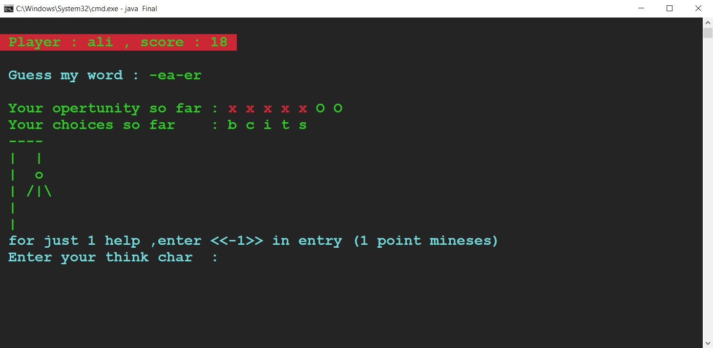
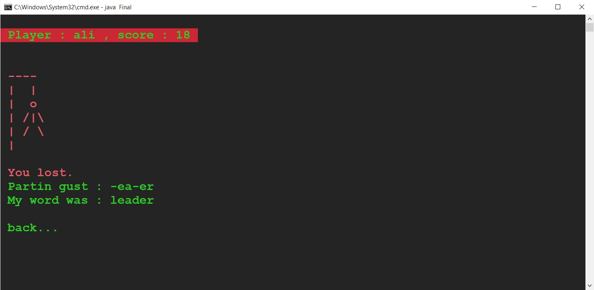

# Hang Man Game

This simple project was my mini project of Advanced Programming Course in Shahid Beheshti University at March 2021. I practiced OOP in java.
Hang man game is a game to guess a word by guessing its letters and it is a little similar to wordle.

## How Run?

1. install java.
2. go to src folder in terminal.
3. enter below commands:
   1. `$ javac Final.java`
   2. `$ java Final`
4. enjoy from game :/

## Screenshots

